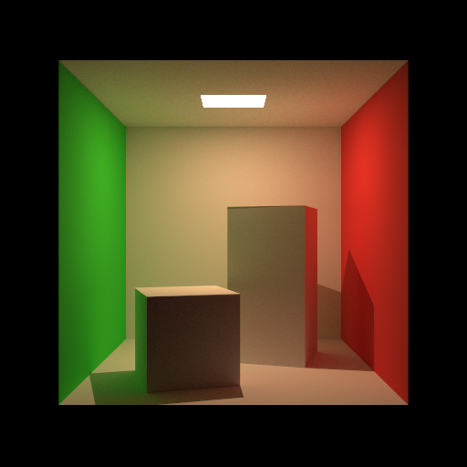

# Luminox

Luminox is a minimal but easily extensible path tracer intended for educational and experimental use.



# Requirements

* C++11 or Higher
* CMake 3.12 or Higher
* OpenMP

## Features

* Sphere and Plane Shape
* Diffuse, Mirror, Glass Material
* Uniform and Checkerboard Texture
* Area Light
* Pinhole Camera Model
* Pure Path Tracing
* Next Event Estimation Path Tracing

## Build

```
mkdir build
cd build
cmake ..
make
```

## Run
```
./build/main
```
